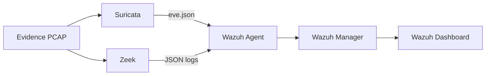

# Telemetry Ingestion & Aggregation Pipeline

A working network detection pipeline, built and validated against a 53-minute packet capture of an active compromise.

## Repository Structure

This repo is split into two parts: the pipeline, and one investigation run through it.

```
.
├── pipeline/
│   ├── architecture.md
│   ├── config/
│   │   ├── suricata/
│   │   │   └── suricata.yaml
│   │   ├── zeek/
│   │   │   ├── local.zeek
│   │   │   └── node.cfg
│   │   ├── wazuh-manager/
│   │   │   └── ossec.conf
│   │   └── wazuh-agent/
│   │       └── ossec.conf
│   ├── detection-rules/
│   │   ├── custom_suricata.rules
│   │   └── local_rules.xml
│   ├── replay.sh
│   └── evidence-manifest.md
│
└── investigation/
    ├── executive-summary.md
    ├── incident-timeline.md
    ├── alert-triage.md
    ├── ioc-list.csv
    ├── logs/
    │   ├── suricata/
    │   │   ├── eve.json
    │   │   └── fast.log
    │   └── zeek/
    │       ├── conn.log
    │       ├── http.log
    │       ├── dns.log
    │       └── weird.log
    └── media/
        └── dashboard-wazuh-example.png
```


## Architecture




Full writeup: `[pipeline/architecture.md](pipeline/architecture.md)`.

## Key Findings


| Finding                                                                        | Severity     |
| ------------------------------------------------------------------------------ | ------------ |
| Active PowerShell C2 beacon, host fingerprinting, live for the full session    | **Critical** |
| A second C2 channel, self-signed TLS certs minted the same day as the incident | **High**     |
| RMM tool deployment with DLL side-loading and Startup-folder persistence       | **High**     |


Full details :`(investigation/alert-triage.md)`.


## Detection Engineering

 Behavior-based Suricata rules and a Wazuh correlation layer were written and replayed against the capture.

- A numeric bot-ID beacon rule that fired 98 times across the session and independently discovered the malware's persistence mechanism and payload-delivery events.
- A PowerShell backdoor status/telemetry callback rule that matches the malware reporting persistence and task status back to C2.
- A fake Microsoft Teams HTA/VBScript dropper rule that matches inbound VBScript using WScript.Shell to launch hidden PowerShell.
- A self-signed TLS certificate rule that had 12 correct matches with zero false positives against the capture's other real TLS sessions.
- A Wazuh correlation layer on top (`local_rules.xml`) that turns two lower signals into one higher-rated alert.


## Reproducing This

The evidence PCAP is **not included in this repository**: see `[pipeline/evidence-manifest.md](pipeline/evidence-manifest.md)` for why and how to get it. Once you have it and have verified its hash:

```bash
./pipeline/replay.sh /path/to/capture.pcap
```

This replays the capture through Suricata and Zeek using the exact configs and rules in `pipeline/`, and writes real output (not this project's pre-existing logs) into `investigation/proof-of-execution/`. Wazuh ingestion is documented as a manual final step, since agent/manager enrollment is too host-specific to safely script.

## Scope & Safety Notes

Everything in this repo was performed in an isolated, authorized lab against an malware-traffic-analysis.net capture:

- No payload extracted from the capture was ever executed, every script and binary was statically decoded or identified only.
- No external IP was scanned, probed, or actively connected to, infrastructure attribution used passive RDAP/WHOIS lookups only.
- All IOCs in `investigation/ioc-list.csv` are defanged.
- The raw PCAP and any extracted payload files are intentionally excluded from this repository.


## About

Created by Jay Kohut as a hands-on DFIR project covering: investigation planning, pipeline construction, alert triage, timeline reconstruction, and custom detection engineering.