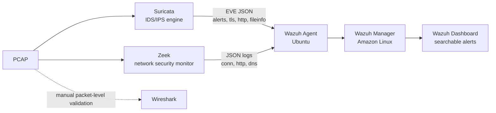

# Pipeline Architecture

A two-node network detection and log-aggregation pipeline: Built on an isolated Ubuntu VM and Wazuh Manager (Amazon Linux) VM, with no exposure to the live internet at any stage.

## Data Flow

## Components

**Suricata**: replays the PCAP offline and evaluates it against both a standard ruleset and a set of custom rules (see `detection-rules/custom_suricata.rules`). Produces `eve.json` (structured alert/tls/http events).

**Zeek:** processes the same PCAP independently and produces session logs (`conn.log`, `http.log`, `dns.log`, `weird.log`) in JSON format.

**Wazuh Agent:** installed on the analysis host, configured to monitor Suricata's `eve.json` output and certain Zeek JSON logs, and forward both into the Wazuh Manager.

**Wazuh Manager:** ingests and decodes the forwarded logs, applies its own ruleset (extended here with a custom correlation layer, see `detection-rules/local_rules.xml`), and makes every event searchable and alertable from the centralized Wazuh Dashboard.

**Wireshark:** used throughout for manual packet validation: confirming what a Suricata alert or Zeek session record, following TCP/HTTP streams, and statically extracting/decoding payloads for analysis.

## Design

No single tool in this stack should function in isolation. Suricata essentially tells you that something matched a signature, but not the full session around it. Zeek gives the surrounding context but doesn't produce alerts itself. Wazuh correlates both into one searchable index. Wireshark allows for manual analysis of the raw capture traffic and artifacts.

Design in action, (see `investigation/root-cause-analysis.md`).

## Tool Versions

| Tool             | Version          |
| ---------------- | ---------------- |
| Operating System | Ubuntu 26.04 LTS |
| Wazuh manager    | 4.14.6           |
| Wireshark        | 4.2.2            |
| Suricata         | 8.0.6            |
| Zeek             | 8.2.0            |
| Wireshark        | 4.6.4            |
| jq               | 1.8.1            |

## Testing the Pipeline

See `replay.sh` and `evidence-manifest.md` for how to get the PCAP capture from its original source and replay it through the pipeline.